# Continuwuity Database Mermaid Diagrams

This document contains visual representations of the Continuwuity database schema using Mermaid diagrams.

## 1. Core Event Storage Architecture

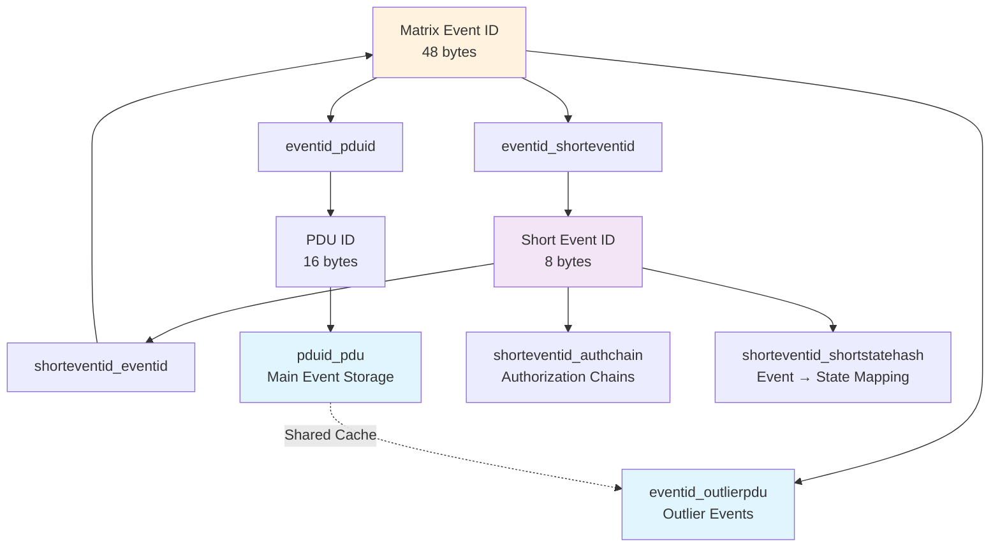

## 2. Room State Management System

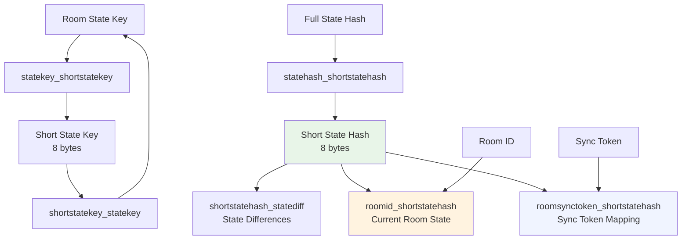

## 3. User Authentication and Identity Flow

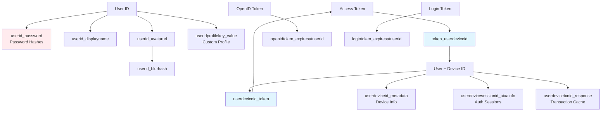

## 4. Room Membership Bidirectional System

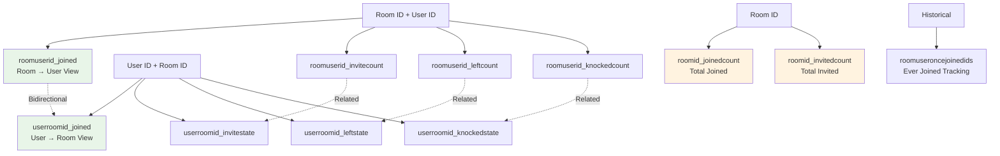

## 5. Cryptography and Key Management Chain

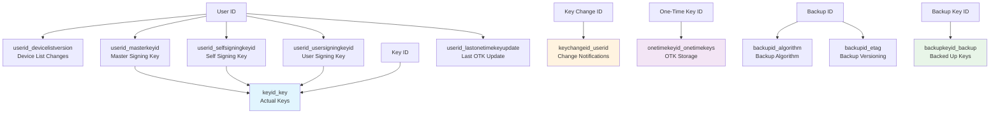

## 6. Federation and Server Communication

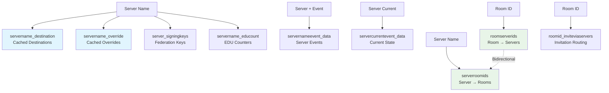

## 7. Push Notifications and Read Tracking

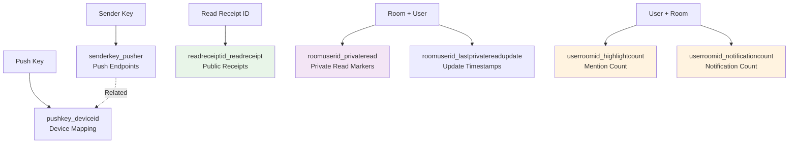

## 8. Media and Content Management

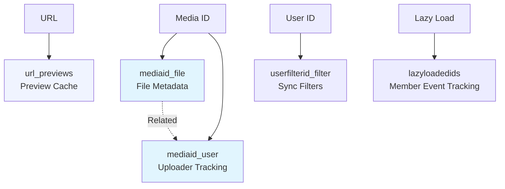

## 9. Account Data and Presence System

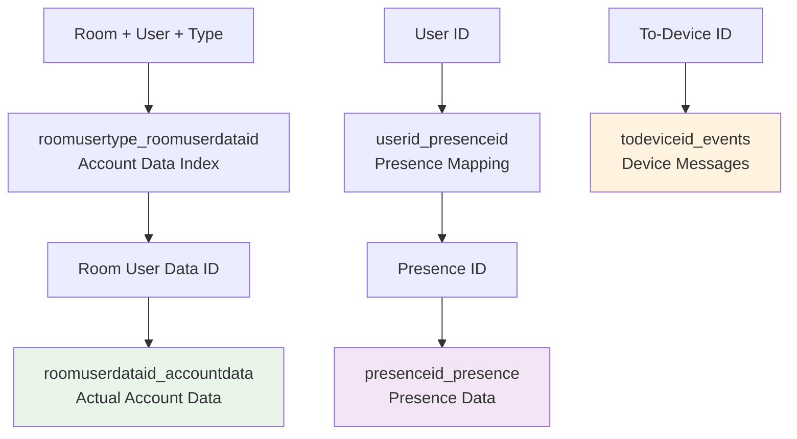

## 10. Global Configuration and Access Control

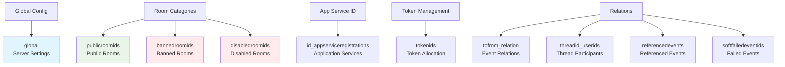

## 11. Complete System Overview

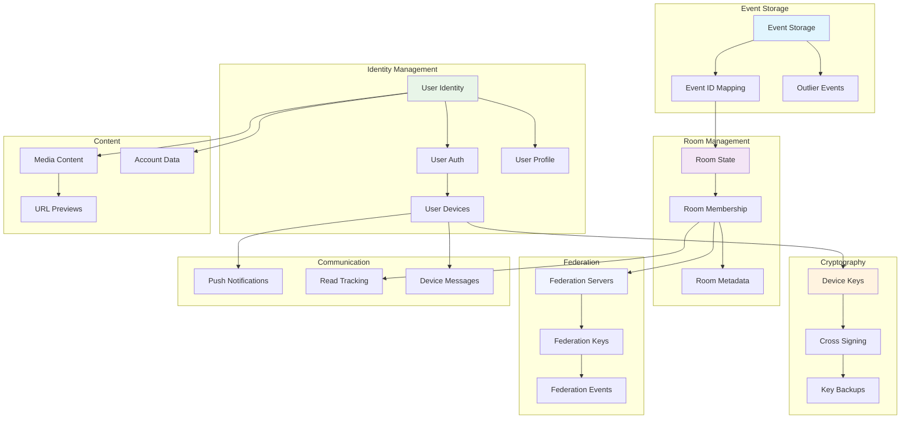

## Diagram Legend

- **Blue boxes** (`#e1f5fe`): Core storage tables
- **Green boxes** (`#e8f5e8`): Membership and relationship tables  
- **Purple boxes** (`#f3e5f5`): ID mapping and compression tables
- **Orange boxes** (`#fff3e0`): Count and metadata tables
- **Light blue boxes** (`#f0f4ff`): Sync and federation tables
- **Red boxes** (`#ffebee`): Access control and security tables
- **Solid arrows**: Direct relationships
- **Dotted arrows**: Bidirectional or related tables
- **Shared Cache notation**: Tables that share memory pools

These diagrams show how Continuwuity's 89 database tables interconnect to provide a complete Matrix homeserver implementation with optimized storage patterns and efficient relationship management.
